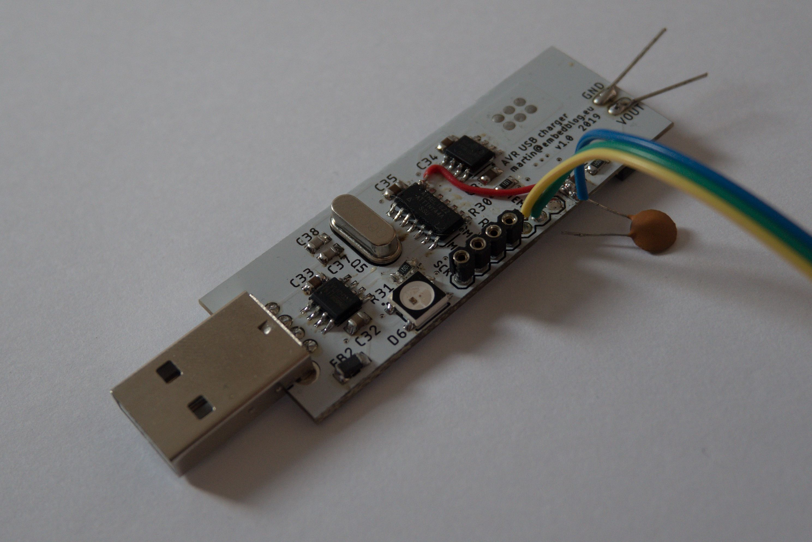

# AVR Li-Ion charger
*see the article [here](http://embedblog.eu/?p=392)*

ATtiny44-controlled buck converter with adjustable charging parameters (charging voltage & current, precharging voltage & current, min/max temperatures, ...). Everything is configurable via a serial port and stored in EEPROM.
